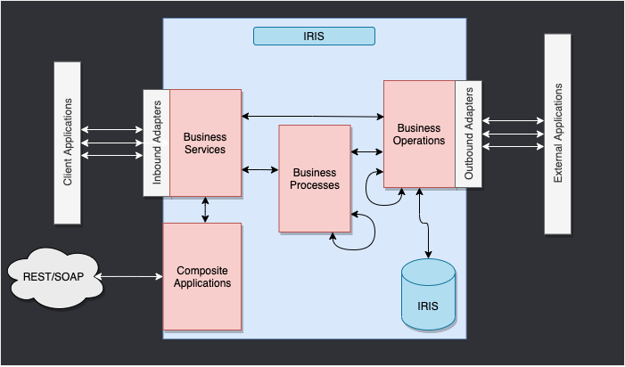

# Component Interaction

This is the IRIS Framework.



The components inside of IRIS represent a production. 

You have 3 main components:
- **BusinessService**: This component aims to receive requests from external applications.
- **BusinessProcess**: This component is responsible for processing the requests and orchestrating the business logic.
- **BusinessOperation**: This component is responsible for executing the technical operations that are needed to fulfill the requests.

The composite applications will give us access to the production through external applications like REST services.

The **arrows** between them all of this components are **messages**.

The messages are the way that the components interact with each other.

## How to exchange messages

To exchange messages between components, you can use the following methods:

- `send_request_sync`: This method is used to send a request synchronously. It will wait for a response before continuing.
- `send_request_async`: This method is used to send a request asynchronously. It will not wait for a response before continuing.
- `send_request_async_ng`: Same as `send_request_async`, but with an ayncio implementation.
- `send_multi_request_sync`: This method is used to send multiple requests synchronously. It will wait for all responses before continuing.
- `send_generator_request`: This method is used to send a request synchronously and return a generator.

## send_request_sync

This method is used to send a request synchronously. It will wait for a response before continuing.

### Function signature

```python
def send_request_sync(self, target: str, request: Union[Message, Any], 
                        timeout: int = -1, description: Optional[str] = None) -> Any:
    """Send message synchronously to target component.
    
    Args:
        target: Name of target component
        request: Message to send
        timeout: Timeout in seconds, -1 means wait forever 
        description: Optional description for logging
        
    Returns:
        Response from target component
        
    Raises:
        TypeError: If request is invalid type
    """
    ...
```

### Example usage

```python
from iop import BusinessProcess
from msg import MyMessage

class MyBP(BusinessProcess):

    def on_message(self, request):
        msg = MyMessage(message="Hello World")
        # Send a synchronous request to the target component
        response = self.send_request_sync("Python.MyBO", msg)
        self.log_info(f"Received response: {response}")
```

## send_request_async

This method is used to send a request asynchronously. It will not wait for a response before continuing.

### Function signature (for BusinessService and BusinessOperation)

```python
def send_request_async(self, target: str, request: Union[Message, Any], 
                        description: Optional[str] = None) -> None:
    """Send message asynchronously to target component.
    
    Args:
        target: Name of target component
        request: Message to send
        description: Optional description for logging
        
    Raises:
        TypeError: If request is invalid type
    """
    ...
```

### Example usage (for BusinessService and BusinessOperation)

```python
from iop import BusinessService
from msg import MyMessage

class MyBS(BusinessService):

    def on_message(self, request):
        msg = MyMessage(message="Hello World")
        # Send an asynchronous request to the target component
        self.send_request_async("Python.MyBO", msg)
        self.log_info("Request sent asynchronously")
```

### Function signature (for BusinessProcess)

```python
def send_request_async(self, target: str, request: Any, description: Optional[str]=None, completion_key: Optional[str]=None, response_required: bool=True) -> None:
    """Send the specified message to the target business process or business operation asynchronously.
    
    Args:
        target: The name of the business process or operation to receive the request
        request: The message to send to the target
        description: An optional description property in the message header
        completion_key: A token to identify the completion of the request
        response_required: Whether a response is required
        
    Raises:
        TypeError: If request is not of type Message or IRISObject
    """
    ...
```

### Example usage (for BusinessProcess)

```python
from iop import BusinessProcess
from msg import MyMessage

class MyBP(BusinessProcess):

    def on_message(self, request):
        msg_one = MyMessage(message="Message1")
        msg_two = MyMessage(message="Message2")

        self.send_request_async("Python.MyBO", msg_one,completion_key="1")
        self.send_request_async("Python.MyBO", msg_two,completion_key="2")

    def on_response(self, request, response, call_request, call_response, completion_key):
        if completion_key == "1":
            self.response_one = call_response
        elif completion_key == "2":
            self.response_two = call_response

    def on_complete(self, request, response):
        self.log_info(f"Received response one: {self.response_one.message}")
        self.log_info(f"Received response two: {self.response_two.message}")
```

## send_request_async_ng

This method is used to send a request asynchronously using an asyncio implementation.

### Function signature

```python
async def send_request_async_ng(self, target: str, request: Union[Message, Any], 
                                   timeout: int = -1, description: Optional[str] = None) -> Any:
    """Send message asynchronously to target component with asyncio.
    
    Args:
        target: Name of target component
        request: Message to send
        timeout: Timeout in seconds, -1 means wait forever 
        description: Optional description for logging
        
    Returns:
        Response from target component
    """
    ...
```

### Example usage

```python
import asyncio
import random

from iop import BusinessProcess
from msg import MyMessage


class MyAsyncNGBP(BusinessProcess):

    def on_message(self, request):

        results = asyncio.run(self.await_response(request))

        for result in results:
            self.logger.info(f"Received response: {result.message}")

        return MyMessage(message="All responses received")

    async def await_response(self, request):
        # create 1 to 10 messages
        tasks = []
        for i in range(random.randint(1, 10)):
            tasks.append(self.send_request_async_ng("Python.MyAsyncNGBO",
                                                    MyMessage(message=f"Message {i}")))

        return await asyncio.gather(*tasks)

```

## send_multi_request_sync

This method is used to send multiple requests synchronously. It will wait for all responses before continuing.

### Function signature

```python
def send_multi_request_sync(self, target_request: List[Tuple[str, Union[Message, Any]]], 
                               timeout: int = -1, description: Optional[str] = None) -> List[Tuple[str, Union[Message, Any], Any, int]]:
    """Send multiple messages synchronously to target components.
    
    Args:
        target_request: List of tuples (target, request) to send
        timeout: Timeout in seconds, -1 means wait forever 
        description: Optional description for logging
        
    Returns:
        List of tuples (target, request, response, status)
        
    Raises:
        TypeError: If target_request is not a list of tuples
        ValueError: If target_request is empty
    """
...
```

### Example usage

```python
from iop import BusinessProcess
from msg import MyMessage


class MyMultiBP(BusinessProcess):

    def on_message(self, request):
        msg_one = MyMessage(message="Message1")
        msg_two = MyMessage(message="Message2")

        tuple_responses = self.send_multi_request_sync([("Python.MyMultiBO", msg_one),
                                                        ("Python.MyMultiBO", msg_two)])

        self.log_info("All requests have been processed")
        for target,request,response,status in tuple_responses:
            self.log_info(f"Received response: {response.message}")
```

## send_generator_request

This method is used to send a request synchronously and return a generator.

### Function signature

```python
    def send_generator_request(self, target: str, request: Union[Message, Any], 
                              timeout: int = -1, description: Optional[str] = None) -> _GeneratorRequest:
    """Send message as a generator request to target component.
    Args:
        target: Name of target component
        request: Message to send
        timeout: Timeout in seconds, -1 means wait forever
        description: Optional description for logging
    Returns:
        _GeneratorRequest: An instance of _GeneratorRequest to iterate over responses
    Raises:
        TypeError: If request is not of type Message
    """
    ...
```

### Example usage

```python
from typing import Any
from iop import BusinessProcess,BusinessOperation

from msg import MyGenerator,MyGeneratorResponse

class MyGeneratorProcess(BusinessProcess):

    def on_request(self, request: Any) -> Any:
        gen = self.send_generator_request(
            target="User.MyGeneratorOperation",
            request=MyGenerator(my_string="Hello, World!"),
            timeout=10,
            description="My generator request")
        
        for response in gen:
            self.log_info(f"Received response: {response}")

class MyGeneratorOperation(BusinessOperation):

    def on_private_session_started(self, request: MyGenerator) -> Any:
        # return the generator to the process that called it
        return self.my_generator(request)

    def my_generator(self, request: Any) -> Any:
        self.log_info(f"Processing request: {request}")
        # Simulate some processing and yield responses
        for i in range(5):
            response = f"Response {i} from MyGeneratorOperation"
            self.log_info(response)
            yield MyGeneratorResponse(my_other_string=response) # notice that we yield a response here
```

