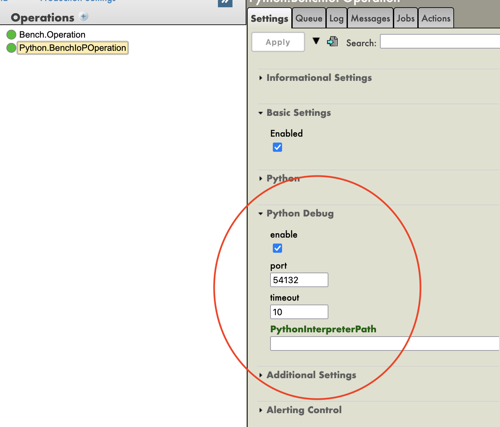
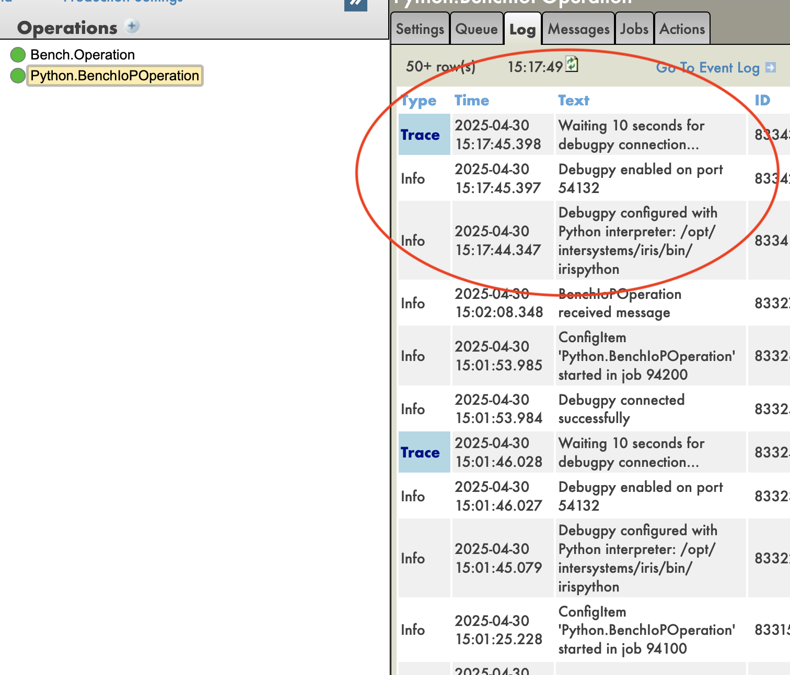
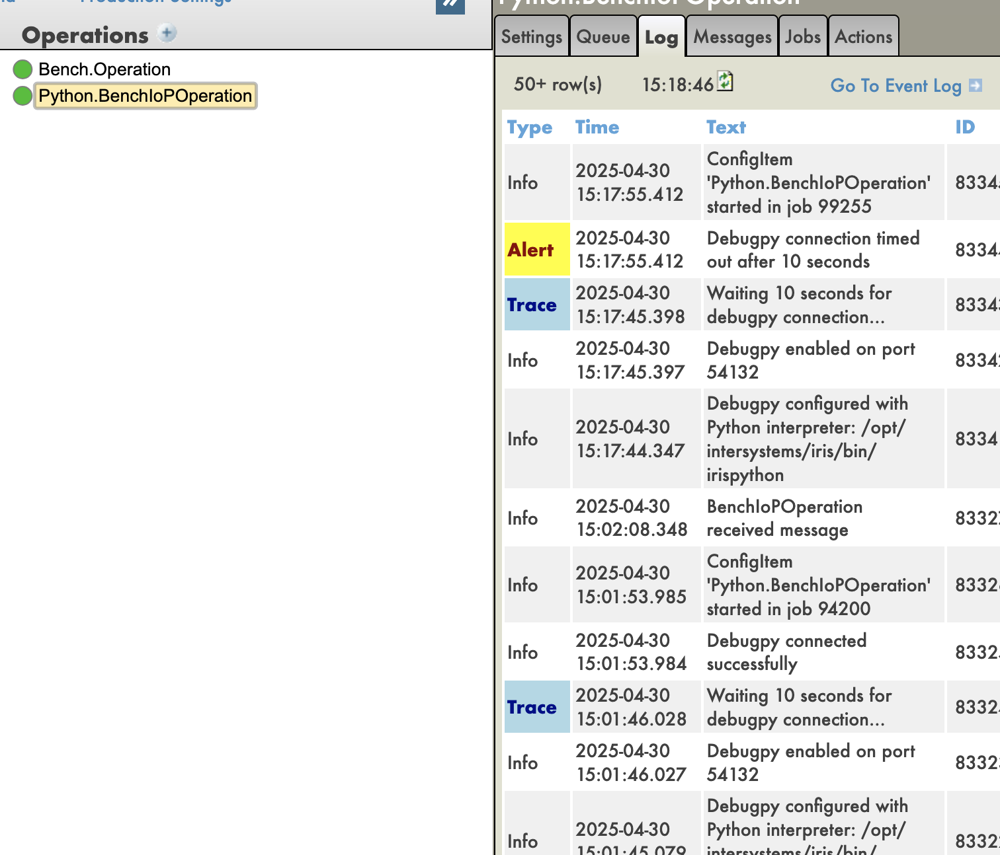
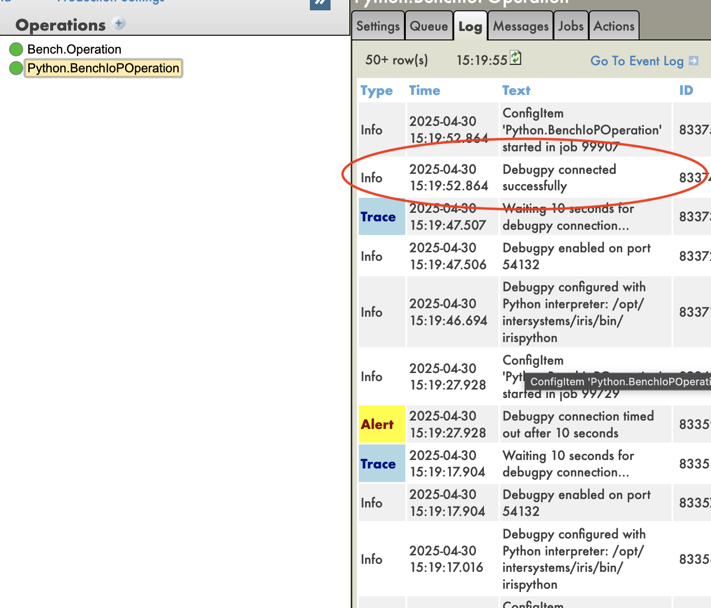
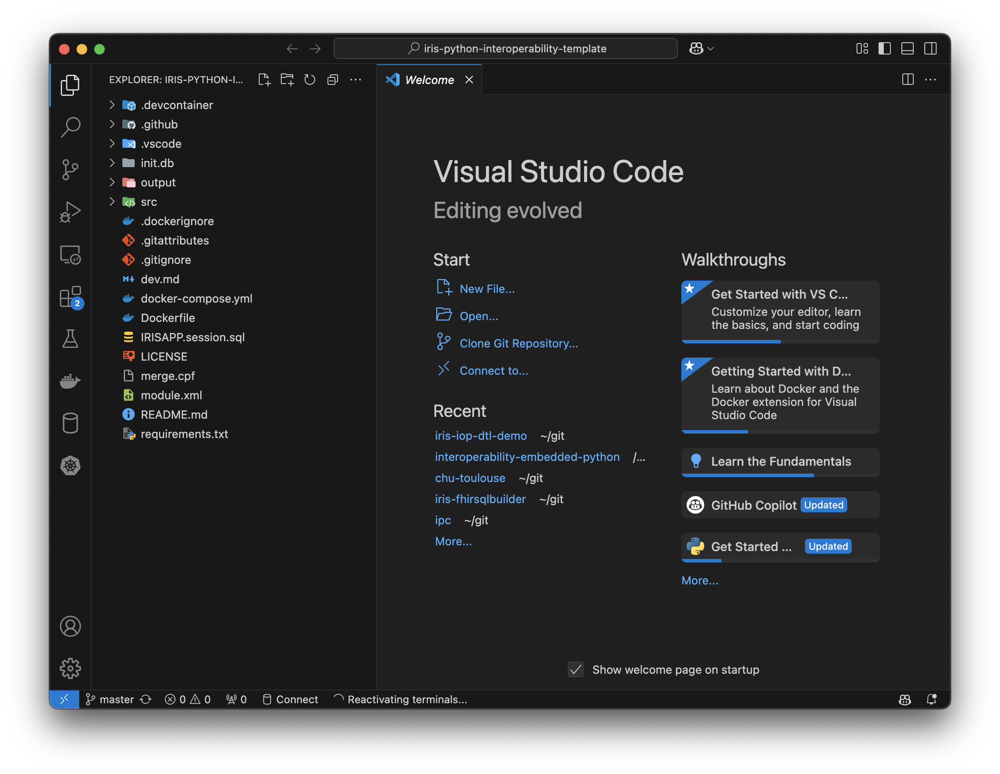
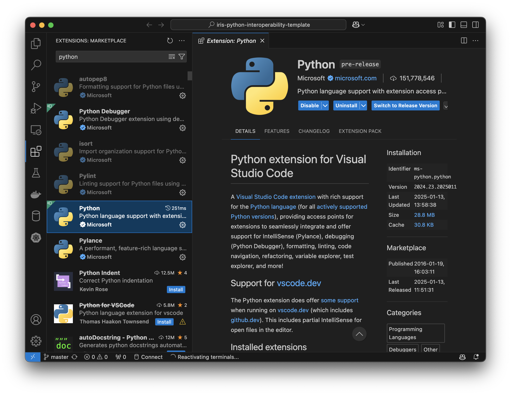
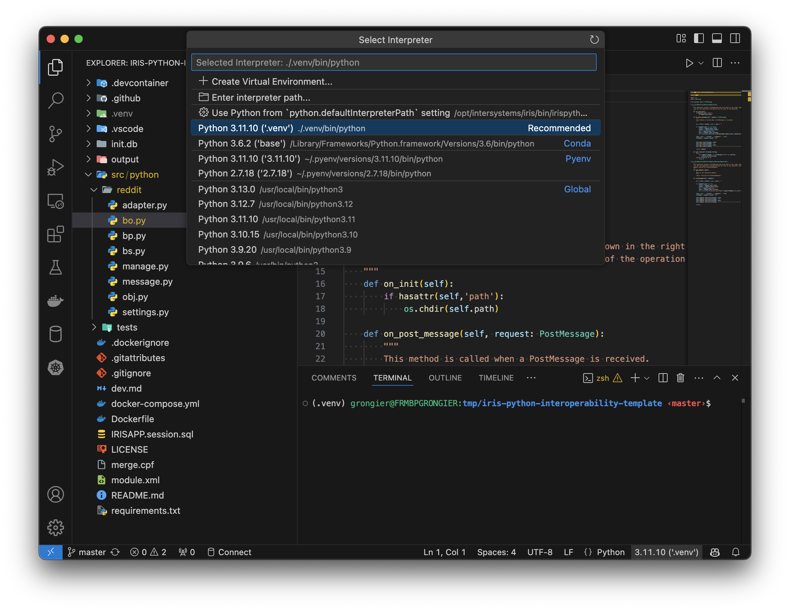
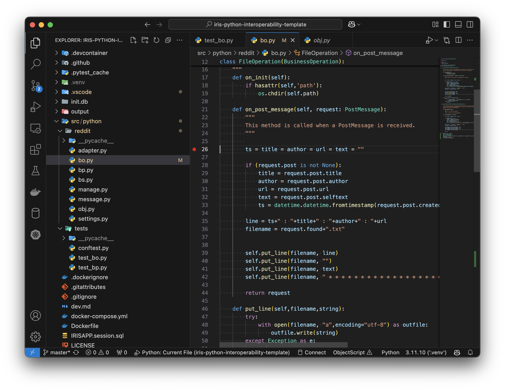
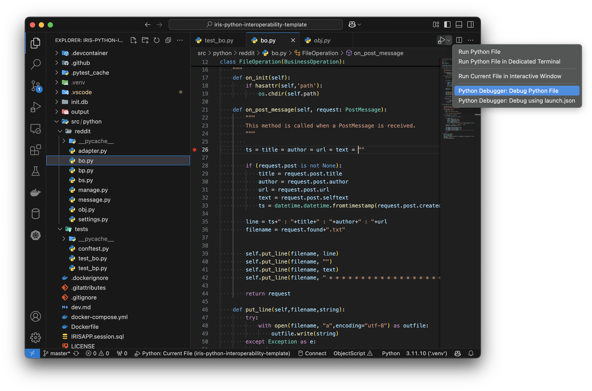
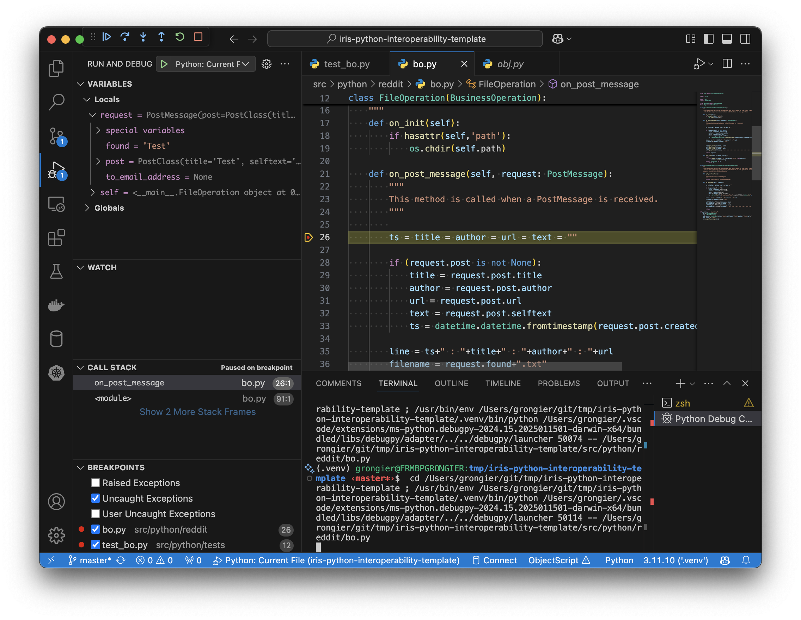

# Debug

How to debug IoP code. 

Before anything, I will put some context about IoP and IRIS.

Next I will show how to debug the code.

Finally, we will give some tips about debugging.

## Context

IoP is a Python library that helps to build interoperability solutions with IRIS.

IoP is based on [Embedded Python in IRIS](https://docs.intersystems.com/iris20243/csp/docbook/DocBook.UI.Page.cls?KEY=AFL_epython).

Embedded Python is a feature of IRIS that allows you to run Python code inside IRIS.

That means the python code is not running by a python interpreter, but by an IRIS process.

## Remote Debugging

To remote debbug your code, you need IoP version 3.4.1 or later.

You will then have access to new options in the management portal.



### Debugging Options

- **Enable Debugging**: This option will enable the remote debugging.
- **Debugging Port**: This option will set the port for the remote debugging. The default port is 0. If you set it to 0, the system will choose a random port. You can also set it to a specific port.
- **Debugging Interpreter**: In the background, the system will create a new python interpreter. This option will set the interpreter to use. **In most cases, you don't need to change this option.**

Then when you start the process, you will see the following message in the logs:



This means that the system is waiting for a connection on the port you set.

Then you can connect to the port with your IDE.

If you wait too long, the system will close the port and you will need to restart the process.


If VsCode is connected to the port, you will see the following message in the logs:

This means that the system is connected to the port and you can start debugging.

### Debugging with VSCode

To debug the code with VSCode, you need to have the following:
- [VSCode](https://code.visualstudio.com/)
- [Python extension](https://marketplace.visualstudio.com/items?itemName=ms-python.python)

Then you need to create a new launch configuration for remote debugging.

You can follow the steps in the [VSCode documentation](https://code.visualstudio.com/docs/python/debugging#_initialize-configurations) to initialize the configurations.
You can also use the following configuration:

```json
{
    "version": "0.2.0",
    "configurations": [
        {
            "name": "Python: Remote Debug",
            "type": "python",
            "request": "attach",
            "connect": {
                "host": "<IRIS_HOST>",
                "port": <IRIS_DEBUG_PORT>
            },
            "pathMappings": [
                {
                "localRoot": "${workspaceFolder}",
                "remoteRoot": "/irisdev/app" // for example path inside the container
                }
            ],
        }
    ]
}
```
You need to change the `<IRIS_HOST>` and `<IRIS_DEBUG_PORT>` to the host and port of your IRIS instance.
You also need to change the `pathMappings` to the path of your python file in IRIS and the path of your python file in your local machine.
The path in IRIS is the path of the file in the IRIS instance. The path in your local machine is the path of the file in your local machine.

### Example

<video controls width="640" height="360">
  <source src="/img/IoPRemoteDebug.mp4" type="video/mp4">
</video>


## Local Debugging

The idea of local debugging is to use an native python interpreter and run the code outside IRIS. This way you can use the python debugger.

The main issue with this approach is that you must have a local instance of IRIS to be able to run the code.

When I mean a local instance, it can be a local installation of IRIS, or a docker container running IRIS.

I will explain first with a local installation of IRIS. Then I will show how to do the same with a docker container.

### Local Installation

To debug the code with a local installation of IRIS, you need to have the following:

- [Local installation of IRIS](https://docs.intersystems.com/irislatest/csp/docbook/Doc.View.cls?KEY=PAGE_deployment_install)
- [Python interpreter compatible with the version of IRIS](https://docs.intersystems.com/iris20243/csp/docbook/Doc.View.cls?KEY=GEPYTHON_prereqs#GEPYTHON_prereqs_version)
- [Iris embedded python wrapper](https://github.com/grongierisc/iris-embedded-python-wrapper)

After you have all the requirements, you can start the IRIS instance and run the python code.

#### Debugging

To debug the code, you can use the python debugger.

Example with VsCode:

1. Open the code in VsCode to an existing folder.

For example, you can use this git repository:

```bash
git clone https://github.com/grongierisc/iris-python-interoperability-template
```

Open the folder `iris-python-interoperability-template` in VsCode.

```bash
code iris-python-interoperability-template
```



2. Install the python extension.

Go to the extensions tab and search for `Python`.



3. Create a virtual environment and select it.

```bash
python -m venv .venv
source .venv/bin/activate
```

And select the virtual environment in VsCode.



4. Install the dependencies.

```bash
pip install -r requirements.txt
```

5. Run the code in debug mode.

Open the file `src/python/reddit/bo.py`, put a breakpoint in the line 26.



And run the code in debug mode.



And you can debug the code.



### Docker Container

The general idea is the same as the local installation.

The main difference is that you need to have a attached VSCode to the docker container.

For that, you can use the [Remote - Containers](https://marketplace.visualstudio.com/items?itemName=ms-vscode-remote.remote-containers) extension.

Then you can attach the VSCode to the docker container and follow the same steps as the local installation.

## Tips

### Use unit tests

The best way to debug the code is to use unit tests.

You can use the python unittest library to write unit tests or pytest.

You have examples in [iris-python-interoperability-template](https://github.com/grongierisc/iris-python-interoperability-template/tree/master/src/python/tests).

### Use if __name__ == '__main__'

You can use the `if __name__ == '__main__':` to run the code only when you run the python file.

Example:

```python
def my_function():
    print('Hello World')

if __name__ == '__main__':
    my_function()
```

You also have examples in [iris-python-interoperability-template](https://github.com/grongierisc/iris-python-interoperability-template/blob/master/src/python/reddit/bo.py#L86).


