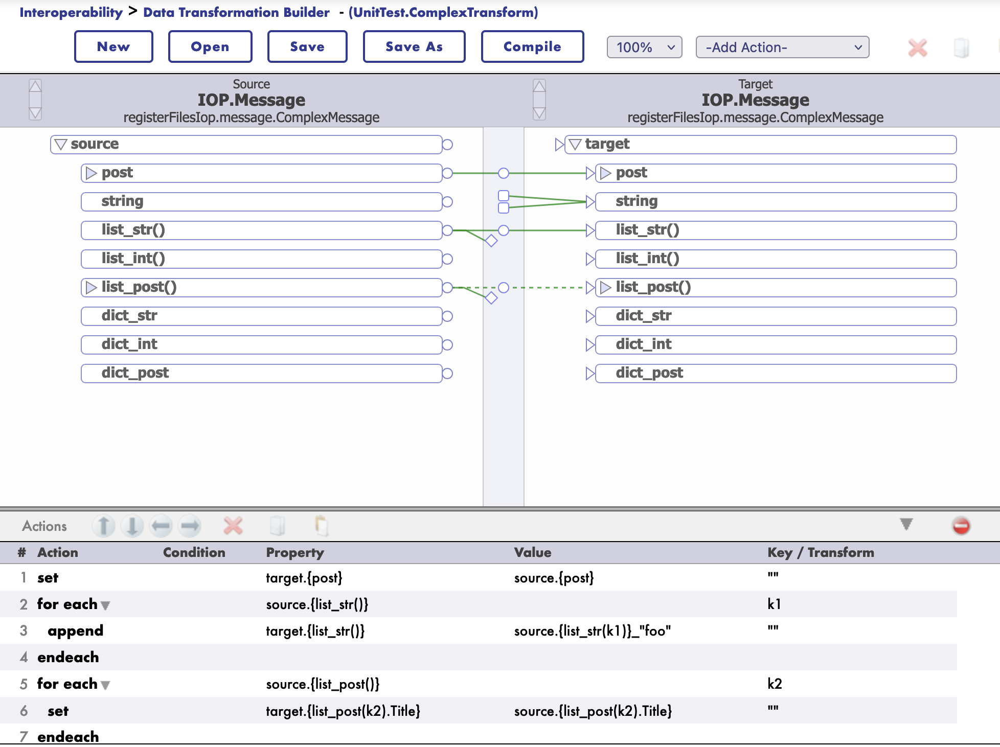

# DTL Support

Starting with version 3.2.0, IoP supports DTL transformations.

DTL is the Data Transformation Layer in IRIS Interoperability. 

DTL transformations are used to transform data from one format to another with a graphical editor.
It supports also `jsonschema` structures.

## How to use DTL in with Message

First you need to register you message class is a `settings.py` file.

To do so, you need to add the following line in the `settings.py` file:

`settings.py`
```
from msg import MyMessage

SCHEMAS = [MyMessage]
```

Then you can use iop migration command to generate schema files for your message classes.

```bash
iop --migrate /path/to/your/project/settings.py
```

### Example

`msg.py`
```python
from iop import Message
from dataclasses import dataclass

@dataclass
class MyMessage(Message):
    name: str = None
    age: int = None
```

`settings.py`
```python
from msg import MyMessage

SCHEMAS = [MyMessage]
```

Migrate the schema files
```bash
iop --migrate /path/to/your/project/settings.py
```

## Building a DTL Transformation

To build a DTL transformation, you need to create a new DTL transformation class.

Go to the IRIS Interoperability Management Portal and create a new DTL transformation.


Then select the source and target message classes.


And its schema.


Then you can start building your transformation.



You can even test your transformation.


Example of payload to test as a source message:

```xml
<test>
  <Message>
    <json><![CDATA[
{
"list_str":["toto","titi"],
"post":{"Title":"foo","Selftext":"baz"},
"list_post":[{"Title":"bar","Selftext":"baz"},{"Title":"foo","Selftext":"foo"}]
}
]]></json>
  </Message>
</test>
```

## JsonSchema Support

Starting with version 3.2.0, IoP supports `jsonschema` structures for DTL transformations.

Same as for message classes, you need to register your `jsonschema`.

To do so, you need to invoke this IRIS command:

```objectscript
zw ##class(IOP.Message.JSONSchema).ImportFromFile("/irisdev/app/random_jsonschema.json","Demo","Demo")
```

Where the first argument is the path to the jsonschema file, the second argument is the package name and the third argument is the name of the schema.

Then you can use it in your DTL transformation.

The schema will be available in the name of `Demo`.

Example `jsonschema` file:

```json
{
    "$schema": "https://json-schema.org/draft/2020-12/schema",
    "type": "object",
    "title": "PostMessage",
    "properties": {
        "post": {
            "allOf": [
                {
                    "$ref": "#/$defs/PostClass"
                }
            ]
        },
        "to_email_address": {
            "type": "string",
            "default": null
        },
        "my_list": {
            "type": "array",
            "items": {
                "type": "string"
            }
        },
        "found": {
            "type": "string",
            "default": null
        },
        "list_of_post": {
            "type": "array",
            "items": {
                "allOf": [
                    {
                        "$ref": "#/$defs/PostClass"
                    }
                ]
            }
        }
    },
    "$defs": {
        "PostClass": {
            "type": "object",
            "title": "PostClass",
            "properties": {
                "title": {
                    "type": "string"
                },
                "selftext": {
                    "type": "string"
                },
                "author": {
                    "type": "string"
                },
                "url": {
                    "type": "string"
                },
                "created_utc": {
                    "type": "number"
                },
                "original_json": {
                    "type": "string",
                    "default": null
                }
            },
            "required": [
                "title",
                "selftext",
                "author",
                "url",
                "created_utc"
            ]
        }
    }
}
```

## Example of DTL Transformation with JsonSchema or Message Class

Many can be found in the `UnitTest` package `./src/tests/cls` directory.

```objectscript
Class UnitTest.ComplexTransform Extends Ens.DataTransformDTL [ DependsOn = IOP.Message ]
{

Parameter IGNOREMISSINGSOURCE = 1;

Parameter REPORTERRORS = 1;

Parameter TREATEMPTYREPEATINGFIELDASNULL = 0;

XData DTL [ XMLNamespace = "http://www.intersystems.com/dtl" ]
{
<transform sourceClass='IOP.Message' targetClass='IOP.Message' sourceDocType='registerFilesIop.message.ComplexMessage' targetDocType='registerFilesIop.message.ComplexMessage' create='new' language='objectscript' >
<assign value='source.{post}' property='target.{post}' action='set' />
<foreach property='source.{list_str()}' key='k1' >
<assign value='source.{list_str(k1)}_"foo"' property='target.{list_str()}' action='append' />
</foreach>
<foreach property='source.{list_post()}' key='k2' >
<assign value='source.{list_post().Title}' property='target.{list_post(k2).Title}' action='append' />
</foreach>
</transform>
}

}
```