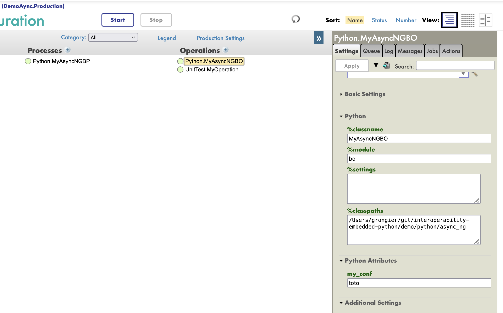
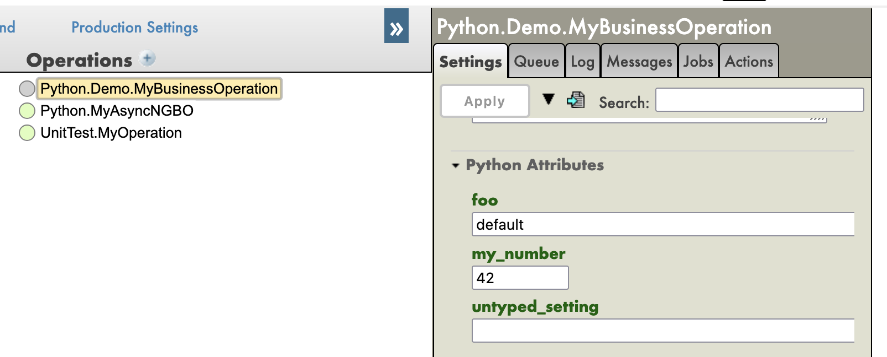

# Settings in production

To pass production settings to your component, you have two options:

- Use the **%settings** parameter
- Create your custom settings

## Context

In production when you select a component, you can configure it by passing settings.



Those settings can be passed to your python code.

## Use the %settings parameter

All the settings passed to **%settings** are available in string format into your class as a root attribute.

Each line of the **%settings** parameter is a key-value pair separated by a the equal sign.

Key will be the name of the attribute and value will be the value of the attribute.

For example, if you have the following settings:

```text
foo=bar
my_number=42
```

You can access those settings in your class like this:

```python
from iop import BusinessOperation

class MyBusinessOperation(BusinessOperation):
    
    def on_init(self):
        self.log_info("[Python] MyBusinessOperation:on_init() is called")
        self.log_info("[Python] foo: " + self.foo)
        self.log_info("[Python] my_number: " + self.my_number)
        return
```

As **%settings** is a free text field, you can pass any settings you want.

Meaning you should verify if the attribute exists before using it.

```python
from iop import BusinessOperation

class MyBusinessOperation(BusinessOperation):
    
    def on_init(self):
        self.log_info("[Python] MyBusinessOperation:on_init() is called")
        if hasattr(self, 'foo'):
            self.log_info("[Python] foo: " + self.foo)
        if hasattr(self, 'my_number'):
            self.log_info("[Python] my_number: " + self.my_number)
        return
```

## Create your custom settings

If you want to have a more structured way to pass settings, you can create your custom settings.

To create a custom settings, you create an attribute in your class.

This attribute must :

- have an default value. 
- don't start with an underscore.
- be untyped or have the following types: `str`, `int`, `float`, `bool`.

Otherwise, it will not be available in the managment portal.

```python
from iop import BusinessOperation

class MyBusinessOperation(BusinessOperation):

    # This setting will be available in the managment portal
    foo: str = "default"
    my_number: int = 42
    untyped_setting = None

    # This setting will not be available in the managment portal
    _my_internal_setting: str = "default"
    no_aviable_setting
    
    def on_init(self):
        self.log_info("[Python] MyBusinessOperation:on_init() is called")
        self.log_info("[Python] foo: " + self.foo)
        self.log_info("[Python] my_number: " + str(self.my_number))
        return
```

They will be available in the managment portal as the following:



If you overwrite the default value in the managment portal, the new value will be passed to your class.