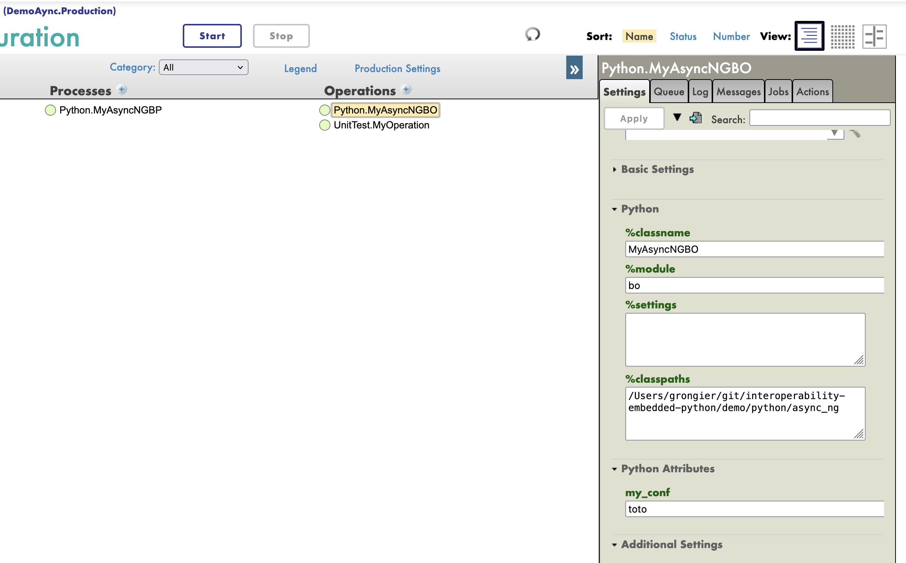
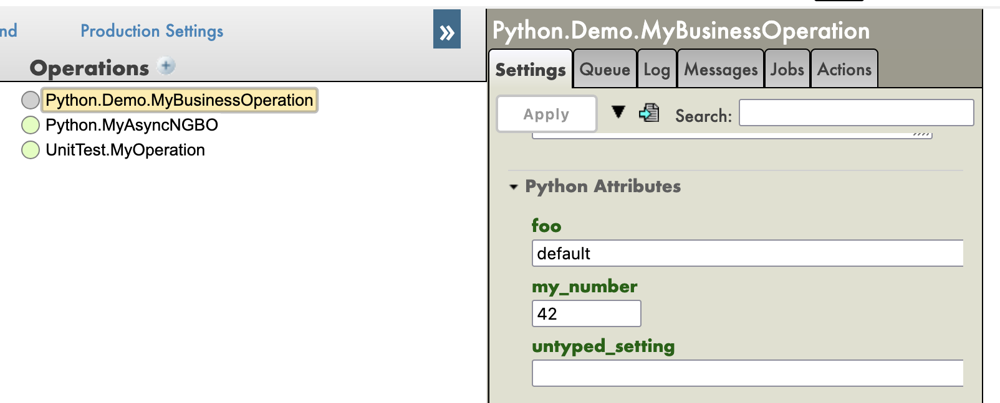

# Settings in production

To pass production settings to your component, you have two options:

- Use the **%settings** parameter
- Create your custom settings

## Context

In production when you select a component, you can configure it by passing settings.



Those settings can be passed to your python code.

IoP/IRIS applies production settings after allocating the Python component
instance with `__new__()`. Read settings in `on_init()` or later; custom
component `__init__()` methods are not called.

## Use the %settings parameter

All the settings passed to **%settings** are available in string format into your class as a root attribute.

Each line of the **%settings** parameter is a key-value pair separated by a the equal sign.

Key will be the name of the attribute and value will be the value of the attribute.

For example, if you have the following settings:

```text
foo=bar
my_number=42
```

You can access those settings in your class like this:

```python
from iop import BusinessOperation

class MyBusinessOperation(BusinessOperation):
    
    def on_init(self):
        self.log_info("[Python] MyBusinessOperation:on_init() is called")
        self.log_info("[Python] foo: " + self.foo)
        self.log_info("[Python] my_number: " + self.my_number)
        return
```

As **%settings** is a free text field, you can pass any settings you want.

Meaning you should verify if the attribute exists before using it.

```python
from iop import BusinessOperation

class MyBusinessOperation(BusinessOperation):
    
    def on_init(self):
        self.log_info("[Python] MyBusinessOperation:on_init() is called")
        if hasattr(self, 'foo'):
            self.log_info("[Python] foo: " + self.foo)
        if hasattr(self, 'my_number'):
            self.log_info("[Python] my_number: " + self.my_number)
        return
```

## Create your custom settings

If you want to have a more structured way to pass settings, you can create your custom settings.

To create a custom settings, you create an attribute in your class.

This attribute must :

- have a default value. 
- not start with an underscore.
- be untyped or have the following types: `str`, `int`, `float`, `bool`.

Otherwise, it will not be available in the management portal.

```python
from iop import BusinessOperation

class MyBusinessOperation(BusinessOperation):

    # This setting will be available in the management portal
    foo: str = "default"
    my_number: int = 42
    untyped_setting = None

    # This setting will not be available in the management portal
    _my_internal_setting: str = "default"
    # no_available_setting  # This line would cause a syntax error
    
    def on_init(self):
        self.log_info("[Python] MyBusinessOperation:on_init() is called")
        self.log_info("[Python] foo: " + self.foo)
        self.log_info("[Python] my_number: " + str(self.my_number))
        return
```

They will be available in the management portal as the following:



If you overwrite the default value in the management portal, the new value will be passed to your class.

## Component Settings

Public class attributes on a component are exposed as IRIS production settings. By default they stay in the generated Python Attributes group. Use `setting(...)` when you want to control how a setting appears in the IRIS production UI.

```python
from iop import BusinessService, Category, controls, setting

class FileService(BusinessService):
    InputDirectory = setting(
        "/data/in",
        category=Category.CONNECTION,
        required=True,
        description="Directory to scan",
        control=controls.directory(),
    )

    Target = setting(
        "",
        category=Category.BASIC,
        required=True,
        control=controls.production_item(),
    )
```

You can also keep normal Python defaults and attach metadata with `typing.Annotated`:

```python
from typing import Annotated
from iop import BusinessService, Category, Setting, controls

class FramedService(BusinessService):
    Framing: Annotated[
        str,
        Setting(
            "None",
            category=Category.CONNECTION,
            control=controls.framing(),
        ),
    ]
```

#### Categories

Categories control where the setting appears in the IRIS production settings UI. They are written to the generated `SETTINGS` parameter as the setting section name. Categories do not change the Python attribute name, default value, IRIS data type, required flag, or editor control.

If `category` is omitted, the setting stays in the generated Python Attributes group. Use `Category` for common IRIS sections, or pass a string when a component needs its own section name.

```python
from iop import Category, setting

Timeout = setting(30, category=Category.BASIC)
ArchiveDirectory = setting("/archive", category="Archiving")
```

| Category | Generated section | Behavior |
| --- | --- | --- |
| `Category.INFO` | `Info` | Groups informational settings. Use for values that identify or describe the component rather than tune runtime behavior. |
| `Category.BASIC` | `Basic` | Groups the most common operational settings. Use for values a production operator is expected to review or change frequently. |
| `Category.CONNECTION` | `Connection` | Groups endpoint, path, credential, protocol, adapter, and network-related settings. |
| `Category.ADDITIONAL` | `Additional` | Groups optional or less frequently changed settings that should remain visible but not compete with the basic settings. |
| `Category.ALERTING` | `Alerting` | Groups alert, notification, and error-reporting settings. |
| `Category.DEV` | `Dev` | Groups development, debug, diagnostic, or troubleshooting settings. |
| `"Custom Name"` | `Custom Name` | Creates or uses a custom section with that exact name. Use sparingly so production settings stay predictable. |

#### Control Helpers

Control helpers return the IRIS production setting editor context string used in the generated `SETTINGS` parameter. They do not validate the selected value in Python; they tell the IRIS Management Portal which picker or selector to show for the setting.

| Helper | Returns | Behavior |
| --- | --- | --- |
| `controls.directory()` | `directorySelector` | Shows the IRIS directory picker. Use for settings that should contain a directory path. |
| `controls.file()` | `fileSelector` | Shows the IRIS file picker. Use for settings that should contain a file path. |
| `controls.production_item()` | `selector?context={Ens.ContextSearch/ProductionItems?targets=1&productionName=@productionId}` | Shows production items from the current production and stores the selected item name. Use for target component settings such as `TargetConfigName`. |
| `controls.credentials()` | `credentialsSelector` | Shows the credentials selector. Use for settings that reference an IRIS credentials entry. |
| `controls.rule()` | `ruleSelector` | Shows the rule selector. Use for settings that reference an IRIS rule definition. |
| `controls.dtl()` | `dtlSelector` | Shows the DTL selector. Use for settings that reference a data transformation. |
| `controls.schedule()` | `scheduleSelector` | Shows the schedule selector. Use for settings that reference an IRIS schedule. |
| `controls.ssl_config()` | `sslConfigSelector` | Shows the SSL/TLS configuration selector. Use for settings that reference an IRIS SSL configuration. |
| `controls.framing()` | `selector?context={Ens.ContextSearch/getDisplayList?host=@currHostId&prop=Framing}` | Shows the display list for the `Framing` property of the current host. Use for adapter framing settings. |
| `controls.character_set()` | `selector?context={Ens.ContextSearch/CharacterSets}` | Shows the IRIS character set selector. Use for charset or encoding settings. |
| `controls.local_interface()` | `selector?context={Ens.ContextSearch/TCPLocalInterfaces}` | Shows configured TCP local interfaces. Use for settings that bind to a local network interface. |
| `controls.schema_category(host)` | `selector?context={Ens.ContextSearch/SchemaCategories?host=<host>}` | Shows schema categories for the specified host. Pass a host expression such as `@currHostId` or a host setting value. |
| `controls.search_table(host)` | `selector?context={Ens.ContextSearch/SearchTableClasses?host=<host>}` | Shows search table classes for the specified host. Pass a host expression such as `@currHostId` or a host setting value. |

`controls.production_item()` accepts optional arguments:

```python
Target = setting(
    "",
    control=controls.production_item(
        targets=True,
        production_name="@productionId",
        multi_select=False,
    ),
)
```

- `targets`: passed to the IRIS `ProductionItems` context as `targets=1` or `targets=0`.
- `production_name`: passed to the IRIS `ProductionItems` context as `productionName=...`.
- `multi_select`: when `True`, adds `multiSelect=1` to the selector.

`controls.framing()` accepts optional arguments:

```python
Framing = setting(
    "None",
    control=controls.framing(host="@currHostId", prop="Framing"),
)
```

- `host`: host expression passed to `Ens.ContextSearch/getDisplayList`.
- `prop`: property name whose display list should be used.

For advanced IRIS controls, pass the raw editor context string:

```python
from iop import controls, setting

Framing = setting(
    "None",
    control=controls.raw(
        "selector?context={Ens.ContextSearch/getDisplayList?host=@currHostId&prop=Framing}"
    ),
)
```