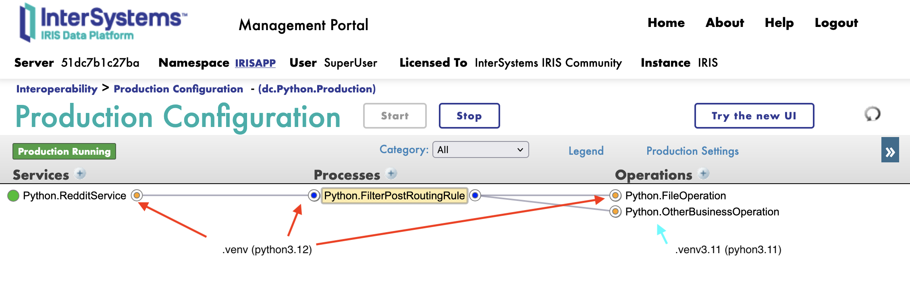
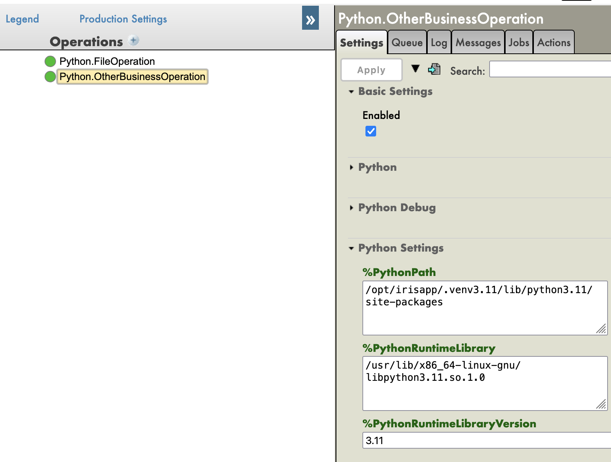
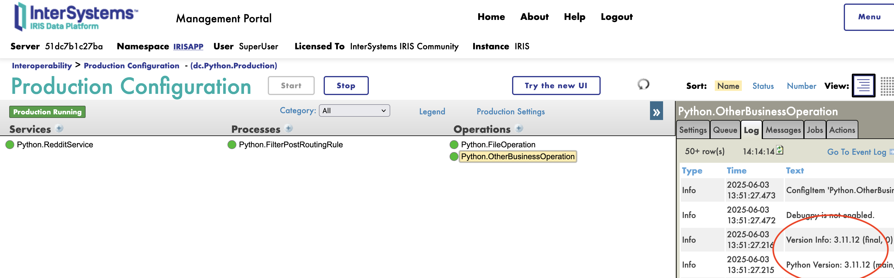
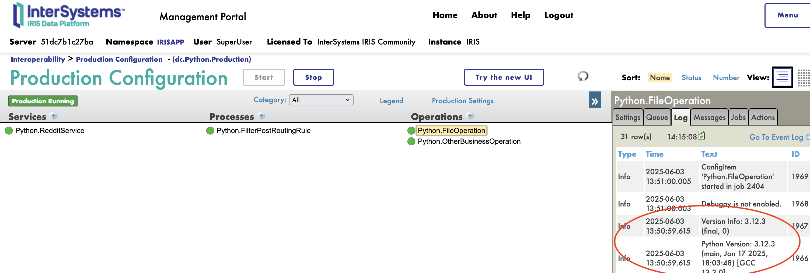
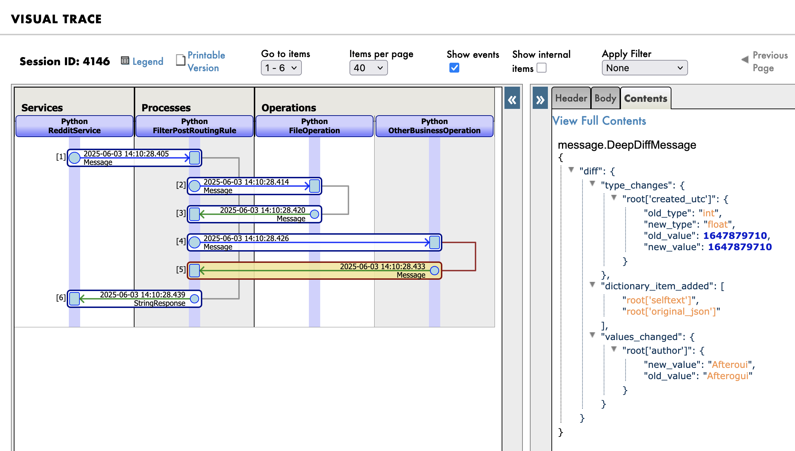

# venv support



How to set up a virtual environment for the Iris IOP framework.

>! Note: This is a proof-of-concept and not a production-ready solution.

As it's a proof-of-concept, a toggle is available and called `%Venv` if you want to enable or disable the virtual environment support.

## How everything is set up

The source code are migrated to iris thanks to the `iop --migrate` command.

Both virtual environments are created using the vanilla `python -m venv` command.

The `iop` command is used to run the source code **in the virtual environments.**

```bash
# activate the secondary virtual environment
source /opt/irisapp/.venv3.11/bin/activate

# migrate the source code
iop -m /irisdev/app/src/python/other/settings.py

# deactivate the secondary virtual environment
deactivate

# activate the main virtual environment
source /opt/irisapp/.venv/bin/activate

# migrate the source code
iop -m /irisdev/app/src/python/reddit/settings.py

# start production
iop --start dc.Python.Production
```

>! Note: if deploying code in a non-venv environment, the parameters `%PythonPath` won't be set, and the code will run in the default python environment.

## Virtual Manual configuration

The parameters :

- `%PythonPath` : the path to the python lib in the virtual environment
- `%PythonRuntimeLibraryVersion` : the version of python used in the virtual environment
- `%PythonRuntimeLibrary` : the path to the lib python in the virtual environment



## Full example

See the full example in the [iris-venv-demo](https://github.com/grongierisc/iris-venv-test).

### How it works

As the interoperability framework works with independent processes, it's manageable to run each process in its own virtual environment.

This allows for easy management of dependencies and versions.

For this demo, we will be using two virtual environments:

- `.venv` 
    - This is the main virtual environment that will run source code in `./src/python/reddit`
    - It will use it's own dependencies in `./src/python/reddit/requirements.txt`
        - `requests`
        - `dataclasses-json`
    - The version of python will be `3.12`
    - The venv folder will be in `/opt/irisapp/.venv/`
- `.venv3.11`
    - This is a secondary virtual environment that will run source code in `./src/python/other`
    - It will use it's own dependencies in `./src/python/other/requirements.txt`
        - `deepdiff`
    - The version of python will be `3.11`
    - The venv folder will be in `/opt/irisapp/.venv3.11/`

### Screenshots



